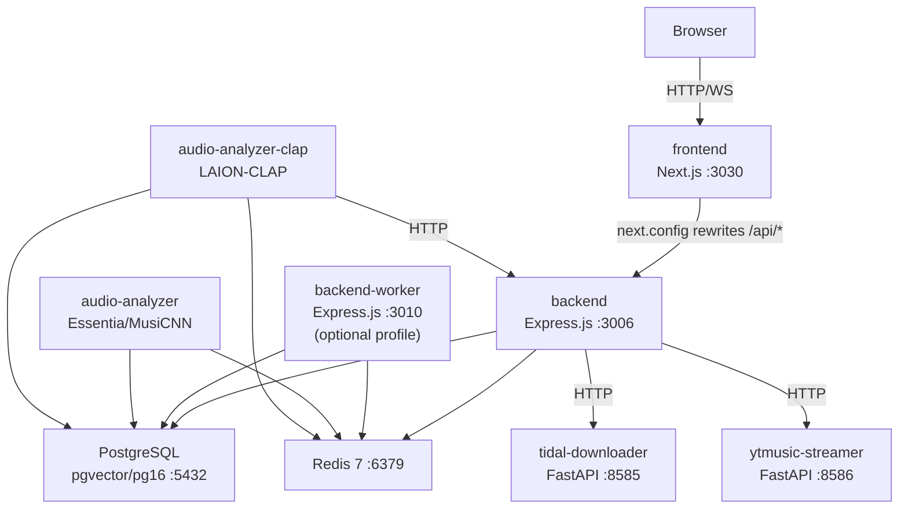

# Architecture

High-level runtime topology, request flows, and service interaction patterns for soundspan.

## Service Topology



## Service Communication Map

| Source | Target | Protocol | Port | Auth | Purpose |
|--------|--------|----------|------|------|---------|
| frontend | backend | HTTP (Next.js rewrites `/api/*`) | 3006 | JWT cookie | All API requests |
| frontend | backend | WebSocket (Socket.IO) | 3006 | JWT | Listen Together real-time sync |
| backend | PostgreSQL | TCP (Prisma) | 5432 | Connection string | All persistent state |
| backend | Redis | TCP | 6379 | None | Listen Together presence/state, cache, pub/sub, stream queues |
| backend | tidal-downloader | HTTP | 8585 | `INTERNAL_API_SECRET` header | TIDAL OAuth, search, stream extraction, downloads |
| backend | ytmusic-streamer | HTTP | 8586 | None (sidecar-internal) | YT Music OAuth, search, stream proxy, browse shelves |
| backend-worker | PostgreSQL | TCP (Prisma) | 5432 | Connection string | Background job state |
| backend-worker | Redis | TCP | 6379 | None | Job queues (BullMQ/streams), scheduler claims |
| audio-analyzer | PostgreSQL | TCP (direct) | 5432 | Connection string | Analysis results write |
| audio-analyzer | Redis | TCP | 6379 | None | BRPOP job queue |
| audio-analyzer-clap | PostgreSQL | TCP (direct) | 5432 | Connection string | Embedding writes |
| audio-analyzer-clap | Redis | TCP | 6379 | None | BRPOP job queue |
| audio-analyzer-clap | backend | HTTP | 3006 | `INTERNAL_API_SECRET` | Track metadata lookup |

## Compose File Matrix

| File | Purpose |
|------|---------|
| `docker-compose.yml` | Split-stack deployment (canonical ports) |
| `docker-compose.aio.yml` | All-in-one single container |
| `docker-compose.local.yml` | Local npm/tsx dev with +1 ports (3031/3007) |
| `docker-compose.services.yml` | Optional Lidarr service |
| `docker-compose.override.ha.yml` | HA-focused override |
| `docker-compose.override.lite-mode.yml` | Analyzer-disabled override |

## Request Flows

### Browser to API

```
Browser → frontend:3030 → Next.js rewrite /api/* → backend:3006 → Prisma → PostgreSQL
```

The frontend proxies all `/api/*` requests to the backend via `next.config.ts` rewrites. The browser never talks to the backend directly. `frontend/lib/api.ts` is the canonical API boundary — no direct `fetch` calls from components.

### Music Playback (Local Library)

```
Browser → GET /api/streaming/track/:id → backend reads file from /music → audio stream response
```

Local files are served directly from the mounted `/music` volume. Transcoded variants are cached in `backend_cache` volume.

### Gap-Fill Playback (TIDAL)

```
Browser → GET /api/tidal-streaming/stream/:tidalId
  → backend → tidal-downloader:8585/stream
    → tidal-downloader uses tiddl + per-user OAuth token → TIDAL CDN
  → audio stream proxied back to browser
```

Each user authenticates their own TIDAL account via device-code OAuth flow. Stream quality is per-user configurable. The backend looks up the user's encrypted OAuth credentials from `UserSettings.tidalOAuthJson`.

### Gap-Fill Playback (YouTube Music)

```
Browser → GET /api/ytmusic/proxy/:videoId
  → backend → ytmusic-streamer:8586/proxy
    → ytmusic-streamer uses yt-dlp to extract stream URL → YouTube CDN
  → audio stream proxied back to browser
```

YouTube `videoId` is permanent; stream URLs from yt-dlp expire in hours. Only `videoId` is stored in `TrackYtMusic`, stream URL is extracted at playback time.

### Track Resolution Priority

When a track needs playback, resolution follows this priority chain:

```
Local file (Track.filePath) → TIDAL (if user connected) → YouTube Music → Unplayable
```

The `TrackMapping` table bridges between local tracks and provider tracks. Mappings are populated lazily during gap-fill, playlist import, or background reconciliation.

### Listen Together (Real-Time Sync)

```
Browser ↔ Socket.IO WebSocket ↔ backend:3006
  → Redis pub/sub (cross-replica sync)
  → Redis state store (session persistence)
  → PostgreSQL (SyncGroup/SyncGroupMember persistence)
```

Listen Together uses in-memory state with Redis-backed cluster sync for multi-replica deployments. Mutation locks prevent concurrent state corruption. State is periodically persisted to PostgreSQL.

### Audio Analysis Pipeline

```
backend writes track to Redis queue
  → audio-analyzer BRPOP → Essentia analysis (BPM, key, mood, energy) → writes to PostgreSQL
  → audio-analyzer-clap BRPOP → CLAP embedding (512-dim vector) → writes to track_embeddings table
```

Analyzers run as independent workers. MusiCNN analyzer writes mood/feature columns on `Track`. CLAP analyzer writes to `TrackEmbedding` for vibe/similarity search via pgvector.

The API process also serves `/api/vibe/map` by reading CLAP embeddings from PostgreSQL, projecting them through an in-process Node worker thread, and caching the normalized coordinates in Redis. That worker entrypoint must resolve in both tsx `src/` runtime and compiled `dist/` runtime layouts.

### Enrichment Pipeline

```
Scheduler (backend or backend-worker) → enrichment worker
  → MusicBrainz API (artist/album metadata)
  → Last.fm API (similar artists, tags)
  → Fanart.tv API (artist hero images)
  → Wikidata API (artist summaries)
  → writes enriched data to Artist/Album rows via Prisma
```

Enrichment runs on a configurable schedule. `Artist.enrichmentStatus` tracks progress. `EnrichmentFailure` table tracks retry state for failed lookups.

## Backend Process Roles

The backend supports three runtime roles via `BACKEND_PROCESS_ROLE`:

| Role | Serves API | Runs Workers/Cron | Default |
|------|-----------|-------------------|---------|
| `all` | Yes | Yes | Yes |
| `api` | Yes | No | |
| `worker` | No (health endpoint only) | Yes | |

For small deployments, `all` is fine. For scale-out, run separate `api` and `worker` containers sharing the same DB and Redis.

## Key Runtime Boundaries

- **Frontend API boundary:** `frontend/lib/api.ts` — all HTTP calls go through here
- **Backend config:** `backend/src/config.ts` — Zod-validated env vars
- **Database access:** Prisma only, no raw SQL
- **Logging:** Shared helpers (`frontend/lib/logger.ts`, `backend/src/utils/logger.ts`, `services/common/logging_utils.py`)
