# Data Model

Entity relationships, classification, and resolution chains for soundspan's Prisma schema.

Schema source: `backend/prisma/schema.prisma` (53 models, 1162 lines)

## Entity Relationship Overview

```mermaid
erDiagram
    User ||--o| UserSettings : has
    User ||--o{ Play : records
    User ||--o{ Playlist : owns
    User ||--o{ LikedTrack : likes
    User ||--o{ LikedRemoteTrack : likes
    User ||--o{ PlaybackState : has
    User ||--o{ SyncGroup : hosts
    User ||--o{ SyncGroupMember : joins
    User ||--o{ DiscoveryAlbum : discovers
    User ||--o{ CachedTrack : caches
    User ||--o{ ApiKey : has
    User ||--o{ InviteCode : creates
    User ||--o| UserDiscoverConfig : configures

    Artist ||--o{ Album : has
    Artist ||--o{ TrackTidal : "resolved from"
    Artist ||--o{ TrackYtMusic : "resolved from"
    Artist ||--o{ SimilarArtist : "similar to"

    Album ||--o{ Track : contains
    Album ||--o{ TrackTidal : "resolved from"
    Album ||--o{ TrackYtMusic : "resolved from"

    Track ||--o{ Play : "played in"
    Track ||--o{ PlaylistItem : "appears in"
    Track ||--o{ TrackMapping : "mapped by"
    Track ||--o{ LikedTrack : "liked by"
    Track ||--o{ MoodBucket : categorized
    Track ||--o{ TrackGenre : tagged
    Track ||--o| TrackEmbedding : "has embedding"
    Track ||--o| TrackLyrics : "has lyrics"

    TrackTidal ||--o{ TrackMapping : "mapped by"
    TrackTidal ||--o{ Play : "played in"
    TrackTidal ||--o{ PlaylistItem : "appears in"
    TrackTidal ||--o{ LikedRemoteTrack : "liked by"

    TrackYtMusic ||--o{ TrackMapping : "mapped by"
    TrackYtMusic ||--o{ Play : "played in"
    TrackYtMusic ||--o{ PlaylistItem : "appears in"
    TrackYtMusic ||--o{ LikedRemoteTrack : "liked by"

    Playlist ||--o{ PlaylistItem : contains

    SyncGroup ||--o{ SyncGroupMember : has

    Podcast ||--o{ PodcastEpisode : has
    Podcast ||--o{ PodcastSubscription : "subscribed to"
    PodcastEpisode ||--o{ PodcastProgress : tracked
    PodcastEpisode ||--o{ PodcastDownload : downloaded
```



## Entity Classification

### Local-Only (file-backed)

| Entity | Purpose | Key Fields |
|--------|---------|------------|
| `Track` | Local audio file | `filePath` (unique), `albumId`, analysis fields (bpm, key, mood, energy, etc.) |
| `TranscodedFile` | Cached transcoded variant | `trackId`, `quality`, `cachePath` |
| `TrackEmbedding` | CLAP 512-dim vector | `trackId`, `embedding` (pgvector) |
| `TrackLyrics` | Synced/plain lyrics | `trackId`, `source` (lrclib, embedded, none) |

### Remote-Provider (catalog references)

| Entity | Purpose | Unique Key | Resolved To |
|--------|---------|------------|-------------|
| `TrackTidal` | TIDAL track reference | `tidalId` (numeric) | `Artist?`, `Album?` via FK |
| `TrackYtMusic` | YouTube Music track reference | `videoId` (string) | `Artist?`, `Album?` via FK |

### Glue Layer (resolution/mapping)

| Entity | Purpose | Links |
|--------|---------|-------|
| `TrackMapping` | "We believe these are the same track" | `trackId?` → Track, `trackTidalId?` → TrackTidal, `trackYtMusicId?` → TrackYtMusic |

TrackMapping is **advisory, not authoritative**:
- Does not own data — connects independent records
- No uniqueness on FKs — same track can appear in multiple mapping rows (same song on multiple albums)
- `confidence` field indicates match certainty
- `source` indicates how the mapping was created: `gap-fill`, `isrc`, `import-match`, `manual`
- `stale` flag marks dead mappings (provider content removed) without deleting

### Universal Entities (cross-provider)

| Entity | Purpose | Notes |
|--------|---------|-------|
| `Artist` | Universal artist (MusicBrainz-backed) | `mbid` (unique), enrichment fields, `remoteTrackCount` for remote-only artists |
| `Album` | Universal album (release-group-backed) | `rgMbid` (unique), `location` enum (LIBRARY, DISCOVER, REMOTE) |

Remote tracks (`TrackTidal`, `TrackYtMusic`) resolve to `Artist`/`Album` entities via `artistResolutionService` and `albumResolutionService`. This enables:
- Artist pages showing both local and remote tracks
- Album pages with mixed local/remote content
- Unified play counts across providers

### User & Auth

| Entity | Purpose |
|--------|---------|
| `User` | Account with role, 2FA, profile |
| `UserSettings` | Per-user preferences, OAuth tokens (encrypted) for YT Music and TIDAL |
| `ApiKey` | Subsonic/API key auth |
| `DeviceLinkCode` | Device pairing codes |
| `InviteCode` / `InviteCodeUsage` | Invite system |

### Playback & Social

| Entity | Purpose |
|--------|---------|
| `Play` | Play history — links to `Track?`, `TrackTidal?`, `TrackYtMusic?`, `ListenSource` enum |
| `PlaybackState` | Per-user per-device queue/position state |
| `SyncGroup` / `SyncGroupMember` | Listen Together sessions |
| `ListeningState` | Resume position for audiobooks/podcasts |
| `LikedTrack` | Local track likes |
| `LikedRemoteTrack` | Remote track likes (Tidal/YT Music) |
| `DislikedEntity` | Generic dislike tracking |

### Playlists

| Entity | Purpose |
|--------|---------|
| `Playlist` | User-owned playlist |
| `PlaylistItem` | Mixed-source items: `trackId?`, `trackTidalId?`, `trackYtMusicId?` |
| `PlaylistPendingTrack` | **@deprecated** — legacy Spotify import pending tracks |
| `HiddenPlaylist` | Per-user playlist hiding |
| `SpotifyImportJob` | Spotify playlist import state |

### Discovery & Recommendations

| Entity | Purpose |
|--------|---------|
| `DiscoveryAlbum` / `DiscoveryTrack` | Weekly discovery albums and their tracks |
| `DiscoveryBatch` / `DownloadJob` | Download orchestration |
| `DiscoverExclusion` | Don't-suggest-again tracking |
| `UserDiscoverConfig` / `UserMoodMix` | Per-user discovery preferences |
| `UnavailableAlbum` | Albums that couldn't be acquired |
| `SimilarArtist` | Weighted artist similarity graph |
| `OwnedAlbum` | Album ownership tracking |

### Content & Media

| Entity | Purpose |
|--------|---------|
| `Podcast` / `PodcastEpisode` | Podcast catalog (RSS-backed) |
| `PodcastSubscription` / `PodcastProgress` / `PodcastDownload` | Per-user podcast state |
| `PodcastRecommendation` | Cached podcast recommendations |
| `Audiobook` / `AudiobookProgress` | Audiobookshelf-synced audiobooks |
| `Genre` / `TrackGenre` | Genre tagging |
| `MoodBucket` | ML-derived mood classifications |

### System

| Entity | Purpose |
|--------|---------|
| `SystemSettings` | Singleton admin config (integrations, download settings, provider toggles) |
| `EnrichmentFailure` | Retry tracking for failed enrichment lookups |
| `Notification` | User notification system |

## Resolution Chains

### Track Playback Resolution (per-user)

```
PlaylistItem/Queue Item
  → trackId? → Track.filePath (local file, best quality)
  → trackTidalId? → TrackTidal.tidalId → tidal-downloader:8585/stream (if user has TIDAL OAuth)
  → trackYtMusicId? → TrackYtMusic.videoId → ytmusic-streamer:8586/proxy (free tier or OAuth)
  → Unplayable (skipped)
```

### Artist/Album Resolution (remote tracks)

```
TrackTidal/TrackYtMusic
  → artistResolutionService.resolveArtist(name) → Artist (find-or-create by normalized name + MusicBrainz)
  → albumResolutionService.resolveAlbum(artist, title) → Album (find-or-create, location=REMOTE)
```

### Gap-Fill (album page)

```
Album loads → check TrackMapping for existing mappings
  → missing tracks: search TIDAL API (if connected) → create TrackTidal + TrackMapping
  → missing tracks: search YT Music API → create TrackYtMusic + TrackMapping
  → next visit: TrackMapping cache hit, no API calls
```

## Enums

| Enum | Values | Used By |
|------|--------|---------|
| `ListenSource` | `LIBRARY`, `DISCOVERY`, `DISCOVERY_KEPT`, `TIDAL`, `YOUTUBE_MUSIC` | `Play.source` |
| `DiscoverStatus` | `ACTIVE`, `LIKED`, `MOVED`, `DELETED` | `DiscoveryAlbum.status` |
| `AlbumLocation` | `LIBRARY`, `DISCOVER`, `REMOTE` | `Album.location` |

## Migration Conventions

- All migrations via Prisma: `npx prisma migrate dev` (development) or `npx prisma migrate deploy` (production)
- Additive/non-breaking preferred: new nullable columns, new tables, deprecate-in-place
- Track table is local-file-authoritative — must not be modified for provider concerns
- Provider tables (TrackTidal, TrackYtMusic) and TrackMapping are additive layer
