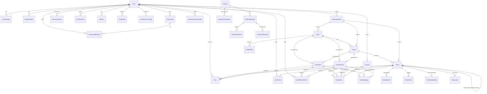

# Data Model

Entity relationships, classification, and resolution chains for soundspan's Prisma schema.

Schema source: `backend/prisma/schema.prisma` (60 models, 1353 lines)

## Entity Relationship Overview


```mermaid
erDiagram
    User ||--o| UserSettings : has
    User ||--o{ Play : records
    User ||--o{ Playlist : owns
    User ||--o{ LikedTrack : likes
    User ||--o{ LikedRemoteTrack : likes
    User ||--o{ PlaybackState : has
    User ||--o{ SyncGroup : hosts
    User ||--o{ SyncGroupMember : joins
    User ||--o{ DiscoveryAlbum : discovers
    User ||--o{ CachedTrack : caches
    User ||--o{ ApiKey : has
    User ||--o{ InviteCode : creates
    User ||--o| UserDiscoverConfig : configures
    User ||--o{ FederationPeer : creates
    User ||--o{ FederationPairingCode : creates

    Artist ||--o{ Album : has
    Artist ||--o{ TrackTidal : "resolved from"
    Artist ||--o{ TrackYtMusic : "resolved from"
    Artist ||--o{ SimilarArtist : "similar to"

    Album ||--o{ Track : contains
    Album ||--o{ TrackTidal : "resolved from"
    Album ||--o{ TrackYtMusic : "resolved from"

    Track ||--o{ Play : "played in"
    Track ||--o{ PlaylistItem : "appears in"
    Track ||--o{ TrackMapping : "mapped by"
    Track ||--o{ LikedTrack : "liked by"
    Track ||--o{ MoodBucket : categorized
    Track ||--o{ TrackGenre : tagged
    Track ||--o| TrackEmbedding : "has embedding"
    Track ||--o| TrackLyrics : "has lyrics"
    Track ||--o{ Track : "deduplicates federated copies"

    FederationPeer ||--o{ Artist : mirrors
    FederationPeer ||--o{ Album : mirrors
    FederationPeer ||--o{ Track : mirrors

    TrackTidal ||--o{ TrackMapping : "mapped by"
    TrackTidal ||--o{ Play : "played in"
    TrackTidal ||--o{ PlaylistItem : "appears in"
    TrackTidal ||--o{ LikedRemoteTrack : "liked by"

    TrackYtMusic ||--o{ TrackMapping : "mapped by"
    TrackYtMusic ||--o{ Play : "played in"
    TrackYtMusic ||--o{ PlaylistItem : "appears in"
    TrackYtMusic ||--o{ LikedRemoteTrack : "liked by"

    Playlist ||--o{ PlaylistItem : contains

    SyncGroup ||--o{ SyncGroupMember : has

    Podcast ||--o{ PodcastEpisode : has
    Podcast ||--o{ PodcastSubscription : "subscribed to"
    PodcastEpisode ||--o{ PodcastProgress : tracked
    PodcastEpisode ||--o{ PodcastDownload : downloaded
```

## Entity Classification

### Local and Federated Music Catalog

| Entity | Purpose | Key Fields |
|--------|---------|------------|
| `Track` | Local file-backed or peer-mirrored music row | `origin`, nullable unique `filePath`, `peerId`/`remoteId`, `dedupOfTrackId`, `dedupPinned`, durable identity keys, soft-removal and analysis fields |
| `TranscodedFile` | Cached transcoded variant for locally served content | `trackId`, `quality`, `cachePath` |
| `TrackEmbedding` | CLAP 512-dim vector; peer embeddings can be imported when scoped | `trackId`, `embedding` (pgvector) |
| `TrackLyrics` | Synced/plain lyrics for local tracks | `trackId`, `source` (lrclib, embedded, none) |

### Remote-Provider (catalog references)

| Entity | Purpose | Unique Key | Resolved To |
|--------|---------|------------|-------------|
| `TrackTidal` | TIDAL track reference | `tidalId` (numeric) | `Artist?`, `Album?` via FK |
| `TrackYtMusic` | YouTube Music track reference | `videoId` (string) | `Artist?`, `Album?` via FK |

### Glue Layer (resolution/mapping)

| Entity | Purpose | Links |
|--------|---------|-------|
| `TrackMapping` | "We believe these are the same track" | `trackId?` → Track, `trackTidalId?` → TrackTidal, `trackYtMusicId?` → TrackYtMusic |

TrackMapping is **advisory, not authoritative**:

- Does not own data — connects independent records
- No uniqueness on FKs — same track can appear in multiple mapping rows (same song on multiple albums)
- `confidence` field indicates match certainty
- `source` indicates how the mapping was created: `gap-fill`, `isrc`, `import-match`, `manual`, or `federation`
- `stale` flag marks dead mappings (provider content removed) without deleting

### Universal Entities (cross-provider)

| Entity | Purpose | Notes |
|--------|---------|-------|
| `Artist` | Universal artist (MusicBrainz-backed) | `mbid` (unique), Prisma-maintained `updatedAt`, enrichment fields, `remoteTrackCount`, optional peer identity |
| `Album` | Universal album (release-group-backed) | `rgMbid` (unique), Prisma-maintained `updatedAt`, `location` enum (`LIBRARY`, `DISCOVER`, `REMOTE`, `FEDERATED`), optional peer identity |

Remote tracks (`TrackTidal`, `TrackYtMusic`) resolve to `Artist`/`Album` entities via `artistResolutionService` and `albumResolutionService`. This enables:

- Artist pages showing both local and remote tracks
- Album pages with mixed local/remote content
- Unified play counts across providers

### Federation

| Entity | Purpose | Key Fields |
| --- | --- | --- |
| `FederationPeer` | One host, consumer, or bidirectional instance link | `direction`, `baseUrl`, unique `credentialHash`, encrypted `outboundToken`, `scopes`, nullable `inboundStatus`, nullable `outboundStatus`, `showDedupedCopies`, nullable `maxConcurrentStreams`/`maxStreamKbps`, sync cursors, `createdById` |
| `FederationPairingCode` | Short-lived, single-use admin pairing grant | unique `code`, `scopes`, `expiresAt`, `usedAt`, `createdById` |
| `FederationTombstone` | Deleted host catalog identity retained for incremental peer deltas | `entityType`, `entityId`, indexed `deletedAt` |
| `FederationPodcastListing` | Lightweight peer podcast catalog row; never a native subscription mirror | `peerId`, `remoteId`, `feedUrl`, `title`, nullable `author`/`imageUrl`, `updatedAt`; unique `(peerId, remoteId)`, indexed `feedUrl` |

`FederationPeer.createdById` uses a restricted user relation, so an owning
administrator cannot be deleted while the peer remains. Deleting a peer
cascades to its mirrored artists, albums, tracks, audiobooks, and podcast
listings. Pairing codes cascade
with their creating user.

`inboundStatus` controls credentials presented by the peer and is populated for
`HOST` and `BOTH`. `outboundStatus` controls sync, health, playback, and online
provenance for `CONSUMER` and `BOTH`. Revocation sets both fields to `REVOKED`.
This separation ensures an outbound health failure cannot disable valid inbound
authentication on a bidirectional row. `maxConcurrentStreams` and
`maxStreamKbps` are nullable host-side limits; null preserves unlimited
streaming. During full sync, `lastSyncCursor` may
contain a JSON full-phase page cursor; completed syncs store the delta
high-water timestamp.

Mirrored `Artist`, `Album`, and `Track` rows store a nullable `peerId` and the
host's `remoteId`; each model has a unique `(peerId, remoteId)` pair. Local rows
leave both fields null. `Track.filePath` remains unique but is nullable because
federated tracks have no consumer-side file.

Mirrored `Audiobook` rows use the same nullable `peerId`/`remoteId` provenance
and unique pair. Their primary IDs are consumer-minted `fed:<uuid>` strings, so
they cannot collide with Audiobookshelf IDs. `AudiobookProgress` already stores
the audiobook ID as a string without a foreign key, so federated progress uses
the existing table and is never written back to Audiobookshelf. Podcast peers
use `FederationPodcastListing` instead of `Podcast`; matching `feedUrl` values
drive native per-user subscription state without violating the global
`Podcast.feedUrl` uniqueness contract.

### User & Auth

| Entity | Purpose |
|--------|---------|
| `User` | Account with role, 2FA, profile |
| `UserSettings` | Per-user preferences, OAuth tokens (encrypted) for YT Music and TIDAL |
| `ApiKey` | Subsonic/API key auth |
| `DeviceLinkCode` | Device pairing codes |
| `InviteCode` / `InviteCodeUsage` | Invite system |

### Playback & Social

| Entity | Purpose |
|--------|---------|
| `Play` | Play history — links to `Track?`, `TrackTidal?`, `TrackYtMusic?`, `ListenSource` enum |
| `PlaybackState` | Per-user per-device queue/position state |
| `SyncGroup` / `SyncGroupMember` | Listen Together sessions |
| `ListeningState` | Resume position for audiobooks/podcasts |
| `LikedTrack` | Local track likes |
| `LikedRemoteTrack` | Remote track likes (Tidal/YT Music) |
| `DislikedEntity` | Generic dislike tracking |

### Playlists

| Entity | Purpose |
|--------|---------|
| `Playlist` | User-owned playlist |
| `PlaylistItem` | Mixed-source items: `trackId?`, `trackTidalId?`, `trackYtMusicId?` |
| `PlaylistPendingTrack` | **@deprecated** — legacy Spotify import pending tracks |
| `HiddenPlaylist` | Per-user playlist hiding |
| `SpotifyImportJob` | Spotify playlist import state |

### Discovery & Recommendations

| Entity | Purpose |
|--------|---------|
| `DiscoveryAlbum` / `DiscoveryTrack` | Weekly discovery albums and their tracks |
| `DiscoveryBatch` / `DownloadJob` | Download orchestration |
| `DiscoverExclusion` | Don't-suggest-again tracking |
| `UserDiscoverConfig` / `UserMoodMix` | Per-user discovery preferences |
| `UnavailableAlbum` | Albums that couldn't be acquired |
| `SimilarArtist` | Weighted artist similarity graph |
| `OwnedAlbum` | Album ownership tracking |

### Content & Media

| Entity | Purpose |
|--------|---------|
| `Podcast` / `PodcastEpisode` | Podcast catalog (RSS-backed) |
| `PodcastSubscription` / `PodcastProgress` / `PodcastDownload` | Per-user podcast state |
| `PodcastRecommendation` | Cached podcast recommendations |
| `Audiobook` / `AudiobookProgress` | Local Audiobookshelf rows and peer-mirrored audiobooks with local per-user progress |
| `Genre` / `TrackGenre` | Genre tagging |
| `MoodBucket` | ML-derived mood classifications |

### System

| Entity | Purpose |
|--------|---------|
| `SystemSettings` | Singleton admin config, including generated federation instance identity and catalog epoch |
| `EnrichmentFailure` | Retry tracking for failed enrichment lookups |
| `Notification` | User notification system |

`SystemSettings.federationInstanceId` and `SystemSettings.catalogEpoch` are
nullable schema fields populated with UUIDs when federation identity is first
needed. The instance ID remains stable. The epoch identifies the current host
catalog generation and forces consumers to perform a full sync when it changes.

## Durable Track Identity and Lifecycle

`Track.id` is the stable local identity. File paths remain unique and
authoritative for same-path updates, while nullable content and tag keys let the
scanner preserve that ID when a file moves, is renamed, or is retagged.

| Field | Meaning |
| --- | --- |
| `audioHash` | Indexed, non-unique `sha256:<hex>` hash of the primary encoded audio stream. Tag edits do not change it. |
| `audioHashedAt` | Time when `audioHash` was computed, used to track backfill and hash freshness. |
| `recordingMbid` | Indexed, non-unique MusicBrainz recording ID read from file tags. |
| `isrc` | Indexed, non-unique first ISRC read from file tags. |
| `removedAt` | Indexed soft-removal timestamp. `null` means the track is active. |

Identity keys are deliberately non-unique because the same audio or recording
can legitimately exist at multiple paths or on multiple releases. Matching
uses the precedence documented in
[`durable-track-identity.md`](designs/durable-track-identity.md): an existing
path wins first, then audio hash, recording MBID, ISRC, album position, and a
tightly bounded metadata fallback.

When a scan cannot find a track, the scanner sets `removedAt` and retains the
row and its relations. It also retains the associated `MISSING_FROM_DISK`
`LibraryHealthRecord`. Normal library, search, recommendation, and streaming
reads exclude these rows, while playlists keep them visible with
`playback.isPlayable: false` and `playback.reason: "track_removed"`.

If a matching file returns, a later scan clears `removedAt`, updates the file
fields, and restores the existing track and its relations. The scheduled purge
permanently deletes rows after `TRACK_REMOVAL_RETENTION_DAYS` (default `90`;
`0` makes them eligible on the next purge cycle).

## Federated Provenance and Local-Wins Deduplication

`Track.origin` separates file-backed `LOCAL` rows from peer-mirrored
`FEDERATED` rows. A federated row stores the owning peer and wire identity in
`peerId`/`remoteId`; its `filePath` is null. Its parent album uses
`AlbumLocation.FEDERATED`, and its artist and album carry the same peer
provenance.

The sync worker compares each federated track with active local tracks by audio
hash, recording MBID, ISRC, then release-group/disc/track position. When a local
match exists, the federated row remains as the peer-owned alternate and sets
`dedupOfTrackId` to the winning local `Track.id`. Browse and search suppress
federated rows with a dedup target by default; `showDedupedCopies` exposes only
the configured peer's alternates.
Deleting the local winner sets `dedupOfTrackId` to null, allowing the peer copy
to become visible again. Peer-to-peer row identity remains the unique
`(peerId, remoteId)` pair.

Administrator link and unlink actions set `dedupPinned=true`. Federation sync
and scanner reconciliation skip pinned rows. Reset clears the pin and
immediately applies the same strongest-first identity matcher, so automatic
arbitration resumes without waiting for another catalog sync or scan.

Federated rows are available to the web library, search, playlists, normal
stream resolution, intelligence surfaces, metadata-based lyrics lookup, and
Subsonic. The track catalog envelope carries optional nullable analyzer fields:
`bpm`, `beatsCount`, `key`, `keyScale`, `keyStrength`, `energy`, `loudness`,
`dynamicRange`, `danceability`, `valence`, `arousal`, `instrumentalness`,
`acousticness`, `speechiness`, seven mood scores, `danceabilityMl`, `moodTags`,
`essentiaGenres`, and `lastfmTags`, plus the scoped optional embedding. The
consumer validates finite numbers and bounded arrays/entries before upsert.
Denormalized artist counts, local file analysis/enrichment, imports,
acquisition/offline downloads, and share links remain local-only. Complete
peer streams may use `TranscodedFile`; audio-hash changes and peer deletion
invalidate both cache rows and files.

## Resolution Chains

### Track Playback Resolution (per-user)

```
PlaylistItem/Queue Item
  → trackId? → active Track.filePath where Track.removedAt is null (local file, best quality)
  → trackId? → active FEDERATED Track → consumer proxy → owning peer /api/federation/v1/stream/:remoteId
  → trackTidalId? → TrackTidal.tidalId → tidal-downloader:8585/stream (if user has TIDAL OAuth)
  → trackYtMusicId? → TrackYtMusic.videoId → ytmusic-streamer:8586/proxy (free tier or OAuth)
  → Removed local playlist item → retained as unplayable with reason track_removed
  → Other unplayable item (skipped)
```

### Artist/Album Resolution (remote tracks)

```
TrackTidal/TrackYtMusic
  → artistResolutionService.resolveArtist(name) → Artist (find-or-create by normalized name + MusicBrainz)
  → albumResolutionService.resolveAlbum(artist, title) → Album (find-or-create, location=REMOTE)
```

### Gap-Fill (album page)

```
Album loads → check TrackMapping for existing mappings
  → missing tracks: search TIDAL API (if connected) → create TrackTidal + TrackMapping
  → missing tracks: search YT Music API → create TrackYtMusic + TrackMapping
  → next visit: TrackMapping cache hit, no API calls
```

## Enums

| Enum | Values | Used By |
|------|--------|---------|
| `ListenSource` | `LIBRARY`, `DISCOVERY`, `DISCOVERY_KEPT`, `TIDAL`, `YOUTUBE_MUSIC` | `Play.source` |
| `DiscoverStatus` | `ACTIVE`, `LIKED`, `MOVED`, `DELETED` | `DiscoveryAlbum.status` |
| `AlbumLocation` | `LIBRARY`, `DISCOVER`, `REMOTE`, `FEDERATED` | `Album.location` |
| `TrackOrigin` | `LOCAL`, `FEDERATED` | `Track.origin` |
| `PeerDirection` | `HOST`, `CONSUMER`, `BOTH` | `FederationPeer.direction` |
| `PeerStatus` | `PENDING`, `ACTIVE`, `OFFLINE`, `REVOKED` | `FederationPeer.inboundStatus`, `FederationPeer.outboundStatus` |

## Migration Conventions

- All migrations via Prisma: `npx prisma migrate dev` (development) or `npx prisma migrate deploy` (production)
- Additive/non-breaking preferred: new nullable columns, new tables, deprecate-in-place
- Local file lifecycle code must scope track reads to `origin=LOCAL` before it uses `filePath`
- Peer-mirrored rows use nullable provenance fields and additive relations; deleting a peer owns their cleanup
- Provider tables (`TrackTidal`, `TrackYtMusic`), federation rows, and `TrackMapping` remain additive layers around the shared catalog
